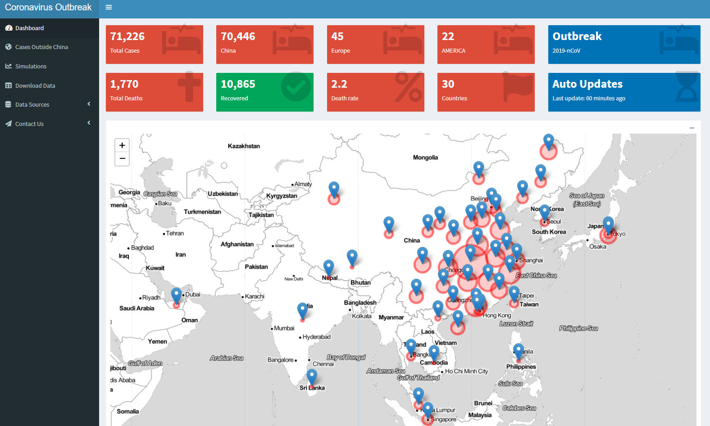
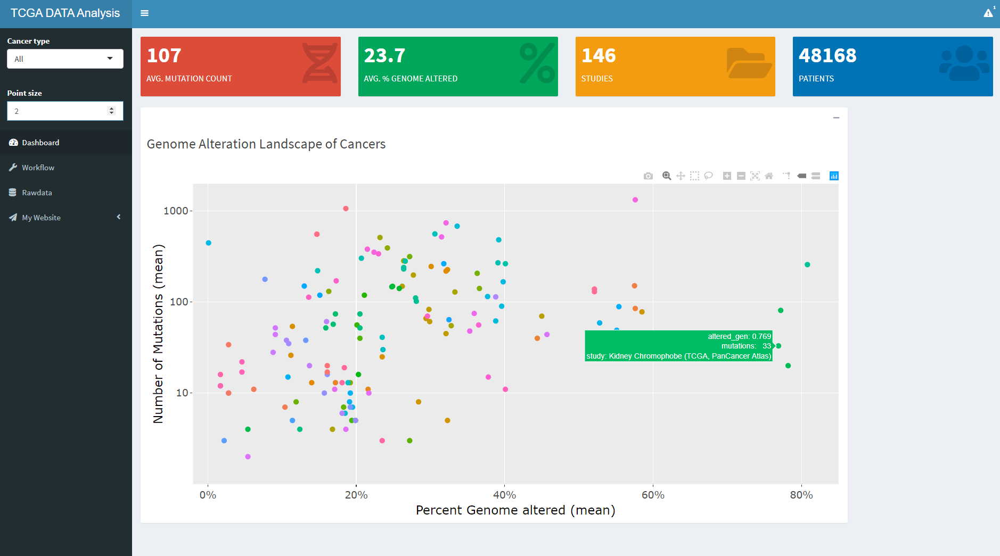
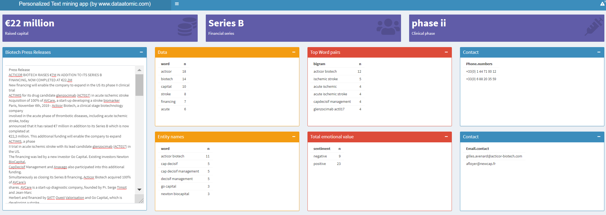

# shiny-server
Repository for my Shiny / Shinydashboard based Web Apps

Track global Coronavirus infections (Covid-19), Updates Automatically
url: http://www.dataatomic-tools.com/shiny/CoronaOutbreak/

  

Explore TCGA genome database. Mutation counts and % Genomic alterations in different types and subtypes of cancers
url: http://tools.dataatomic.com/shiny/TCGA_dashboard_on_server/

  

Natural language processing: Extract key information from Biotech press releases
url: http://tools.dataatomic.com/shiny/autotext/

  

